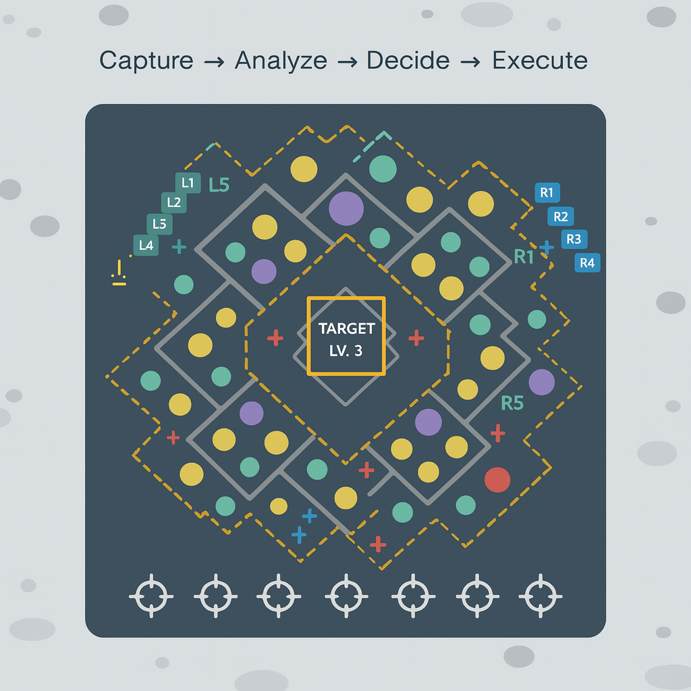

# MobileGameAutomationFramework  

MobileGameAutomationFramework is a **modular system for automating mobile games** using **computer vision, input control, and AI-based decision-making**.  
It demonstrates how to capture a game screen, analyze its state, and automatically plan interactions.  

⚠️ **Note:** This project is a **portfolio demo**. It is not intended for production use, bypassing Terms of Service, or competitive advantage in online games.  

---

## 🚀 Highlights  

At its current stage, the framework can:  
- Capture, interaction and analyze live mobile game screens.  
- Detect and classify relevant in-game objects.  
- Generate overlays with **action points, labels, and directions**.  
- Propose interaction strategies using AI-driven logic.  
- Execute actions either virtually (software simulation) or on a physical device (via GRBL-controlled machine).  

### Implemented Features
- **Screen Capture**: Grab frames from mirrored devices or emulators.  
- **Object Recognition**: Computer vision modules (OCR, template matching).  
- **State Detection**: Identify game resources, objects, and layout.  
- **Border/Shape Analysis**: Detect edges and align action geometry.  
- **Action Point Generation**: Compute optimized interaction points.  
- **Overlay Visualization**: Debug view with crosses, dots, and arrows.  
- **Automation Loop**: *Capture → Analyze → Decide → Execute*.  

---

### 📊 Example Overlay Visualization  


  

---

## 🛠️ Technology Stack  

- **C# .NET 9** – Core framework & orchestration  
- **Python (Dockerized)** – Computer vision & image analysis  
- **GRBL / Arduino UNO** – Optional hardware controller for real devices  
- **Ollama / LLMs** – Local AI models for decision-making  
- **Cross-platform** – Works with emulators, mirrored devices, or synthetic demos  

---

## 📂 Project Structure  

```plaintext
MobileGameAutomationFramework.sln

├── AutomationApp/            
│   └─ Uses **Configuration.CommandLine** + **DependencyInjection**
│
├── ScreenCapture/            
│   └─ Frame grabbing from AirPlay / emulator 
│
├── InputControl/             
│   └─ **System.IO.Ports** (Arduino/GRBL hardware control)  
│      **System.Runtime.InteropServices** (software screen input simulation)  
│
├── BotCore/                  
│   └─ **VisualCoordinator** orchestrating automation loop  
│      Uses **System.Drawing** for overlays  
│      Uses **Stateless** (StateMachine) for workflow logic  
│
├── Infrastructure/           
│   └─ Shared models & enums & DTOs (core .NET types)  
│
├── Ollama/                   
│   └─ AI integration via **OllamaSharp**  (local container with llama3.2-vision)
│      Uses **System.Drawing.Common** for preprocessing  
│
├── ImageAnalyzerService/     
│   └─ Docker container exposing local REST API  
│      Base: **nvidia/cuda:12.5.1**  
│
│      Core Python libs:
│      - Flask, gunicorn, flasgger  
│      - pytesseract, Pillow  
│      - numpy, opencv-python  
│      - torch (PyTorch w/ CUDA)  
│
├── Tests/                    
│   └─ Unit & integration tests with:  
│      - Microsoft.NET.Test.Sdk  
│      - MSTest  

